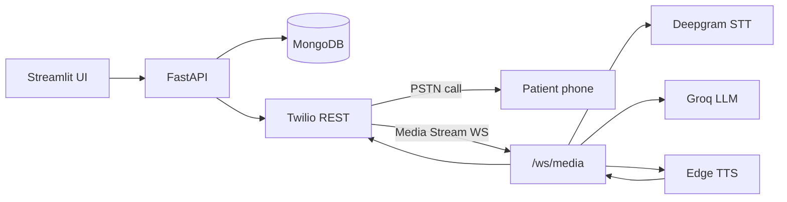

# Voice AI Agent — Appointment Reminder & Confirmation

Outbound voice agent that places phone calls to remind patients about upcoming appointments and confirm, reschedule, or cancel them.

**Two voice providers:**
- **Custom pipeline** — Twilio → Deepgram → Groq → Edge TTS (you own each layer)
- **Vapi** — managed voice AI with the same scenario; webhooks sync transcripts to MongoDB

**FastAPI** backend, **Streamlit** UI, **MongoDB** persistence.

See **`IMPLEMENTATION.txt`** for the full architecture and implementation guide.

## Architecture



### Call flow

1. User triggers an outbound call from the Streamlit UI (or `POST /api/calls/outbound`).
2. FastAPI creates a call record in MongoDB and asks Twilio to dial the number.
3. Twilio hits `POST /webhooks/twilio/voice`, which returns TwiML `<Connect><Stream>` to your public WebSocket URL.
4. On connect, the agent speaks an opening line (Edge TTS → μ-law 8 kHz for Twilio).
5. Caller audio streams to Deepgram (μ-law / 8 kHz). Final transcripts go to Groq with appointment context.
6. Replies are synthesized and streamed back. Outcomes (`confirmed`, `reschedule_requested`, `cancelled`) update MongoDB.

### Design decisions

| Area | Choice | Why |
|------|--------|-----|
| Scenario | Appointment reminder | Clear script, realistic evaluation, structured outcomes |
| Persona | “Alex” @ HealthCare Plus | Professional, concise voice UX |
| Custom media | Twilio Media Streams | Full self-built STT/LLM/TTS pipeline |
| Vapi | Optional provider | Faster production path; same prompts & MongoDB |
| LLM | Groq `llama-3.3-70b-versatile` | Fast, low-latency (custom + Vapi transient assistant) |
| TTS | Edge TTS (custom) / Vapi voice (vapi) | Custom uses free Edge TTS; Vapi uses configured voice |
| State | MongoDB | Appointments, calls, full transcripts for review |
| Extensibility | `app/scenarios/` | Add scenarios without changing core stream logic |

## Prerequisites

- Python 3.11+
- [FFmpeg](https://ffmpeg.org/download.html) on PATH (required by `pydub` for MP3 → μ-law)
- [ngrok](https://ngrok.com/) (or similar) to expose localhost to Twilio
- Accounts: Twilio and/or [Vapi](https://vapi.ai), Deepgram, Groq, MongoDB Atlas

## Setup

This project uses a **local virtual environment** at `venv/`. All commands below use that venv — you do not need a global `pip install`.

### 1. Install into `venv` (Windows)

**Option A — scripts (recommended):**

```powershell
cd c:\Users\abdul\MYDOCUMENTS\VOICEBOT
.\setup.bat
```

**Option B — manual:**

```powershell
cd c:\Users\abdul\MYDOCUMENTS\VOICEBOT
python -m venv venv          # skip if venv already exists
.\venv\Scripts\Activate.ps1
python -m pip install -r requirements.txt
```

`run_api.bat` and `run_ui.bat` call `venv\Scripts\python.exe` directly, so they work even if the venv is not activated.

**Cursor / VS Code:** open the project folder; the workspace points the Python interpreter to `venv\Scripts\python.exe` (see `.vscode/settings.json`).

### 2. Environment

Use either `.env` or `.ENV` in the project root (both are loaded):

```powershell
copy .env.example .env
```

Edit with your credentials. **Never commit secrets.**

Your existing `.ENV` keys are supported: `STT`, `TWILLIO_*` (typo alias), or standard `TWILIO_*` / `DEEPGRAM_API_KEY`.

| Variable | Description |
|----------|-------------|
| `PUBLIC_BASE_URL` | Public HTTPS base URL (ngrok), e.g. `https://abc123.ngrok-free.app` |
| `MONGODB_URI` | MongoDB connection string |
| `TWILIO_*` | Account SID, auth token, outbound caller ID |
| `DEEPGRAM_API_KEY` | Deepgram API key |
| `GROQ_API_KEY` | Groq API key |
| `VAPI_API_KEY` | Vapi private key (if using Vapi provider) |
| `VAPI_PHONE_NUMBER_ID` | Phone number ID from Vapi dashboard |

### 3. Expose the API

Twilio must reach your machine for webhooks and WebSocket media:

```bash
ngrok http 8000
```

Set `PUBLIC_BASE_URL` in `.env` to the ngrok **https** URL (no trailing slash).

### 4. Run services (from project root, uses `venv`)

Terminal 1 — API:

```powershell
.\run_api.bat
```

Or with venv activated:

```powershell
.\venv\Scripts\Activate.ps1
python -m uvicorn app.main:app --host 0.0.0.0 --port 8000 --reload
```

Terminal 2 — UI:

```powershell
.\run_ui.bat
```

Or:

```powershell
.\venv\Scripts\Activate.ps1
python -m streamlit run ui/streamlit_app.py
```

Open http://localhost:8501

### 5. Twilio

- Buy/configure a voice-capable number.
- No console TwiML needed — webhooks are set per call from the API.
- For trial accounts, verify destination numbers.

## API overview

| Method | Path | Description |
|--------|------|-------------|
| `GET` | `/health` | Health check |
| `POST` | `/api/appointments` | Create appointment |
| `GET` | `/api/appointments` | List appointments |
| `GET` | `/api/calls/providers` | List voice providers (custom / vapi) |
| `POST` | `/api/calls/outbound` | Place outbound call (`provider`: custom \| vapi) |
| `GET` | `/api/calls` | Recent calls + transcripts |
| `POST` | `/webhooks/twilio/voice` | Twilio TwiML (internal) |
| `WS` | `/ws/media` | Twilio Media Stream (custom only) |
| `POST` | `/webhooks/vapi` | Vapi server messages (vapi only) |

### Example: outbound call

```bash
curl -X POST http://localhost:8000/api/calls/outbound \
  -H "Content-Type: application/json" \
  -d "{\"phone_number\": \"+15551234567\", \"scenario\": \"appointment_reminder\", \"patient_name\": \"Jane Doe\"}"
```

## Project structure

```
app/
  main.py                 # FastAPI app + WebSocket
  config.py               # Settings
  api/routes/             # REST + Twilio webhooks
  services/               # Twilio, Deepgram bridge, Groq, TTS, media stream
  scenarios/              # Appointment reminder script & prompts
  repositories/           # MongoDB access
  schemas/                # Pydantic models
ui/
  streamlit_app.py        # Operator UI
```

## Adding scenarios

1. Add `app/scenarios/your_scenario.py` with `SCENARIO_ID`, `SYSTEM_PROMPT`, `opening_line()`, `detect_outcome()`.
2. Register scenario id in the UI select box.
3. Extend `GroqConversationService` to load the new system prompt.

## Troubleshooting

| Issue | Fix |
|-------|-----|
| Call connects but no agent voice | Check FFmpeg; inspect API logs for TTS errors |
| Twilio never connects stream | `PUBLIC_BASE_URL` must be HTTPS ngrok URL |
| No transcription | Verify `DEEPGRAM_API_KEY`; check Deepgram quota |
| `API Offline` in UI | Start uvicorn; set `FASTAPI_URL` if not default |

## Security note

Rotate any credentials that were shared in chat or committed by mistake. Use `.env` only locally and keep `.gitignore` excluding secrets.

## License

MIT — use freely for evaluation and extension.
