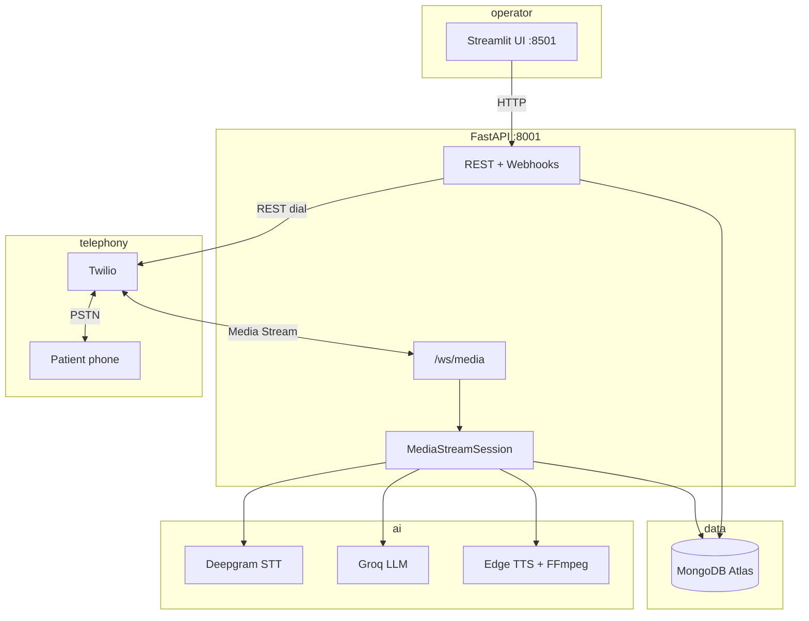

# Voice AI Agent — Appointment Reminder

Outbound voice agent that calls patients to remind them about upcoming appointments and handle **confirm**, **reschedule**, or **cancel** requests.

Built with a self-hosted real-time pipeline:

**Twilio** (telephony) → **Deepgram** (STT) → **Groq** (LLM) → **Edge TTS** (speech) → **Twilio** (playback)

Operators use a **Streamlit** dashboard; the **FastAPI** backend owns call logic, webhooks, and MongoDB persistence.

---

## Features

- Outbound calls from the UI or REST API
- Live conversation over Twilio Media Streams (WebSocket)
- Appointment context injected into every LLM turn
- Full transcripts and per-turn latency metrics in MongoDB
- Barge-in (caller can interrupt the agent while it speaks)
- Telephony-tuned STT (`nova-2-phonecall`) with turn debouncing
- Extensible scenarios under `app/scenarios/`

---

## Architecture



### Call flow

1. Operator triggers `POST /api/calls/outbound` (or clicks **Start call** in Streamlit).
2. FastAPI creates a call record in MongoDB and asks Twilio to dial the number.
3. Twilio requests `POST /webhooks/twilio/voice`, which returns TwiML `<Connect><Stream>` to your public WebSocket URL.
4. On connect, the agent plays an opening line (Edge TTS → μ-law 8 kHz).
5. Caller audio streams to Deepgram; **final** transcripts are sent to Groq with appointment context.
6. Replies are synthesized and streamed back. Outcomes update the appointment in MongoDB.

---

## Prerequisites

| Requirement | Purpose |
|-------------|---------|
| **Python 3.11+** | Runtime |
| **FFmpeg** on `PATH` | Converts Edge TTS MP3 → μ-law for Twilio |
| **ngrok** (local dev) | Public HTTPS + WebSocket for Twilio |
| **Twilio** account | Outbound calls + Media Streams |
| **Deepgram** API key | Speech-to-text |
| **Groq** API key | LLM |
| **MongoDB Atlas** | Appointments, calls, transcripts |

---

## Quick start (Windows)

### 1. Install dependencies

```powershell
cd c:\Users\abdul\MYDOCUMENTS\VOICEBOT
.\setup.bat
```

This creates `venv\` and installs packages from `requirements.txt`.

### 2. Configure environment

```powershell
copy .env.example .env
```

Edit `.env` with your credentials. The app also reads `.ENV` if you use that filename on Windows.

**Never commit real secrets.**

### 3. Expose the API to Twilio

Twilio must reach your machine for HTTP webhooks and the media WebSocket.

```powershell
ngrok http 8001
```

Copy the **https** URL (no trailing slash) into `.env`:

```env
PUBLIC_BASE_URL=https://abc123.ngrok-free.app
```

### 4. Run the services

**Terminal 1 — API:**

```powershell
.\run_api.bat
```

Wait for `Connected to MongoDB` and `Application startup complete`.

**Terminal 2 — UI:**

```powershell
.\run_ui.bat
```

Open **http://localhost:8501**

### 5. Place a test call

1. Create an appointment on the **Appointments** tab.
2. On **Place call**, select the appointment and enter an E.164 number (e.g. `+15551234567`).
3. Click **Start call**.
4. For **Twilio trial** accounts: verify the destination number in the Twilio console; answer the call and press **1** when prompted.

---

## Environment variables

| Variable | Required | Description |
|----------|----------|-------------|
| `PUBLIC_BASE_URL` | Yes | Public HTTPS base URL (ngrok or production domain) |
| `MONGODB_URI` | Yes | MongoDB connection string |
| `MONGODB_DB_NAME` | No | Database name (default `voicebot`) |
| `TWILIO_ACCOUNT_SID` | Yes | Twilio account SID |
| `TWILIO_AUTH_TOKEN` | Yes | Twilio auth token |
| `TWILIO_PHONE_NUMBER` | Yes | Outbound caller ID (E.164) |
| `TWILIO_CALL_TIMEOUT` | No | Ring timeout in seconds (default `60`) |
| `DEEPGRAM_API_KEY` | Yes | Deepgram key (`STT=` alias also supported) |
| `DEEPGRAM_MODEL` | No | Default `nova-2-phonecall` |
| `STT_TURN_DEBOUNCE_MS` | No | Wait after last STT final before LLM (default `1100`) |
| `STT_ENDPOINTING_MS` | No | Deepgram endpointing (default `700`) |
| `GROQ_API_KEY` | Yes | Groq API key |
| `GROQ_MODEL` | No | Default `llama-3.3-70b-versatile` |
| `EDGE_TTS_VOICE` | No | Default `en-US-JennyNeural` |
| `API_PORT` | No | Default `8001` (see `run_api.bat`) |
| `FASTAPI_URL` | No | URL Streamlit uses (default `http://127.0.0.1:8001`) |

---

## API reference

Base URL: `http://127.0.0.1:8001` (local)

| Method | Path | Description |
|--------|------|-------------|
| `GET` | `/health` | Health check |
| `GET` | `/health/tts` | Test Edge TTS + FFmpeg |
| `GET` | `/config/public` | Public URLs and config flags |
| `GET` | `/debug/stream` | WebSocket URL Twilio should use |
| `POST` | `/api/appointments` | Create appointment |
| `GET` | `/api/appointments` | List appointments |
| `GET` | `/api/appointments/{id}` | Get appointment |
| `PATCH` | `/api/appointments/{id}` | Update appointment |
| `GET` | `/api/calls/status` | Pipeline readiness |
| `POST` | `/api/calls/outbound` | Place outbound call |
| `GET` | `/api/calls` | Recent calls + transcripts |
| `GET` | `/api/calls/{id}` | Single call |
| `POST` | `/webhooks/twilio/voice` | Twilio TwiML (internal) |
| `POST` | `/webhooks/twilio/status` | Twilio status callbacks |
| `WS` | `/ws/media` | Twilio Media Stream |

### Example: outbound call

```bash
curl -X POST http://127.0.0.1:8001/api/calls/outbound \
  -H "Content-Type: application/json" \
  -d "{
    \"phone_number\": \"+15551234567\",
    \"scenario\": \"appointment_reminder\",
    \"patient_name\": \"Jane Doe\",
    \"provider_name\": \"Dr. Smith\",
    \"clinic_name\": \"HealthCare Plus Clinic\",
    \"clinic_address\": \"123 Wellness Ave\",
    \"appointment_datetime\": \"2026-05-25T15:30:00\"
  }"
```

Interactive docs: **http://127.0.0.1:8001/docs**

---

## Project structure

```
VOICEBOT/
├── app/
│   ├── main.py                 # FastAPI app + /ws/media
│   ├── config.py               # Settings from .env
│   ├── api/routes/
│   │   ├── appointments.py
│   │   ├── calls.py
│   │   └── webhooks.py         # Twilio TwiML + status
│   ├── services/
│   │   ├── media_stream.py     # Real-time voice pipeline
│   │   ├── deepgram_stt.py
│   │   ├── groq_service.py
│   │   ├── tts_service.py
│   │   ├── twilio_service.py
│   │   └── stt_filters.py
│   ├── scenarios/
│   │   └── appointment_reminder.py
│   ├── repositories/           # MongoDB access
│   └── schemas/                # Pydantic models
├── ui/
│   └── streamlit_app.py
├── run_api.bat
├── run_ui.bat
├── setup.bat
├── requirements.txt
└── .env.example
```

---

## Deployment

Deploy **one backend** (FastAPI). Optionally deploy **Streamlit** for operators.

| Component | Deploy? |
|-----------|---------|
| FastAPI (`uvicorn app.main:app`) | **Required** |
| Streamlit UI | Optional (internal tool) |
| MongoDB Atlas | Already cloud — configure URI only |
| Twilio, Deepgram, Groq | API keys only — no deploy |
| Edge TTS | Runs inside your FastAPI process (needs outbound internet) |
| ngrok | Dev only — use a real HTTPS domain in production |

**Production requirements:**

- Public **HTTPS** URL → `PUBLIC_BASE_URL`
- **WebSocket** support for `/ws/media`
- **FFmpeg** installed on the server
- All secrets in environment variables (not in git)

Example process:

```bash
uvicorn app.main:app --host 0.0.0.0 --port 8001
```

Good hosting options: VPS (DigitalOcean, AWS EC2, Azure VM), Railway, Render, or Fly.io — verify WebSocket support on your plan.

---

## Adding scenarios

1. Add `app/scenarios/your_scenario.py` with:
   - `SCENARIO_ID`
   - `SYSTEM_PROMPT`
   - `build_context_block(context)`
   - `opening_line(context)`
   - `detect_outcome(user_text, assistant_text)`
2. Register the scenario id in `ui/streamlit_app.py`.
3. Extend `GroqConversationService` to load the new prompt.

---

## Troubleshooting

| Symptom | What to check |
|---------|----------------|
| **API Offline** in UI | Run `run_api.bat`; set `FASTAPI_URL=http://127.0.0.1:8001` |
| Call connects, no agent voice | `GET /health/tts` — install FFmpeg on PATH |
| Twilio never opens media stream | `PUBLIC_BASE_URL` must be HTTPS; ngrok must tunnel **8001** |
| No transcription | `DEEPGRAM_API_KEY`; Deepgram quota; API logs for Deepgram errors |
| Instant `busy` status | Carrier/trial limits (especially international); verify destination on trial |
| Garbled STT | Phone line quality; try speaking clearly; check `STT normalized` in logs |
| Slow replies | LLM is usually fast; TTS (~1.5–2 s) dominates — prompts are kept short |

**Verify pipeline:**

```powershell
curl http://127.0.0.1:8001/api/calls/status
curl http://127.0.0.1:8001/health/tts
```

During a live call, ngrok should show a **WebSocket** `GET /ws/media` with status **101**.

---

## Security

- Keep `.env` / `.ENV` out of version control (see `.gitignore`).
- Rotate any credentials that were exposed in chat or commits.
- Use MongoDB Atlas IP allowlisting or VPC peering in production.
- Restrict Streamlit to trusted networks if deployed.

---

## License

MIT — use freely for evaluation and extension.
